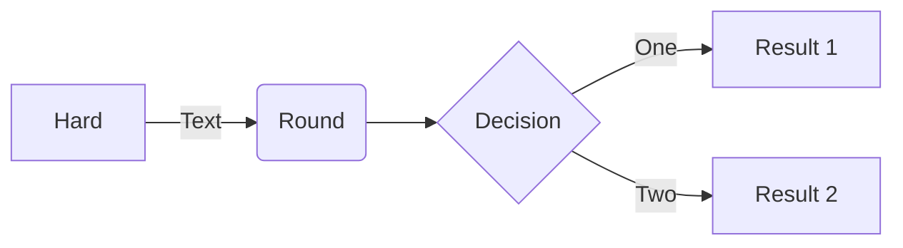

# OpenBPJudge Project

基于 [Hydro](https://github.com/hydro-dev/Hydro) 框架，已适配 hydrooj 5.0.0-beta.9。

## frontend-bpjudge

-  用 uname color 代替 level badge。

对应规则：

```
{
    'lv0': '#c2ccd0',
    'lv1': '#c2ccd0',
    'lv2': '#c2ccd0',
    'lv3': '#0e90d2',
    'lv4': '#0e90d2',
    'lv5': '#00bc12',
    'lv6': '#00bc12',
    'lv7': '#ff8936',
    'lv8': '#ff8936',
    'lv9': '#ff3300',
    'lv10': '#ff3300',
}
```

- 简化页脚。

- 修改 `getListForRender` 方法，为 scoreboard 添加 uname color 支持。

- 题目列表、题目详情等页面以文字形式显示难度。

其中，difficulty 与文字难度对应如下：

difficulty 1-7 分别对应：

```
[
    "入门", "普及-", "普及/提高-", "普及+/提高", "提高+/省选-", "省选/NOI-", "NOI/NOI+"
];
```

其余难度为 "暂无评定"。

- 支持 Tuack 风格表格渲染。

```
::cute-table{tuack}
| Header 1 | Header 2 |
| -------- | -------- |
| Cell 1   | Cell 2   |
```

## onlineuser-bpjudge

路由 `/onlineuser`。查询五分钟内活动过的会话。


## activeuser-bpjudge

idea from [topscoding](https://topscoding.com/).

首页滚动展示两小时内活跃用户。

使用方法：

进入控制面板->系统设置->`hydrooj.homepage` 添加如下配置： `active_user: true` 保存即可。

## announce-bpjudge

路由 `/announce`。

首页展示公告：

进入控制面板->系统设置->`hydrooj.homepage` 添加如下配置： `announce: <limit>` 保存即可，其中 `<limit>` 需**完整**替换为公告展示数量。

## ac-celebration-bpjudge

提交通过后展示 AC 弹窗动画。

安装方式：将插件 clone 到本地，插件目录下执行 `yarn install` 安装依赖，执行 `hydrooj addon add <插件路径>` 然后 `pm2 restart hydrooj` 重启即可。

使用方式：控制面板-系统设置中 `acImage` 类别下 `Image display duration` 和 `Image url` 字段分别对应弹窗动画持续时间和 AC 动画图片的路径。持续时间单位为**毫秒（ms）**。默认为 `3500` 和 `/ac-congrats.png`。

支持设置多张图片，AC 后将随机选择一张弹出。

默认图片（`ac-congrats.png`）来源：[洛谷](https://www.luogu.com.cn/)。

## mermaid

支持渲染 mermaid。

例如：

````

````

## problem-vote

登录用户可对题目投票。
